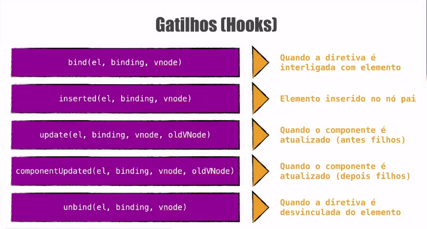

# Curso Vue

## 1. Diretivas
São propriedades passadas dentro das tags **html**, funcionam da seguinte forma:
```html
<tag v-diretiva:argumento.modificador="'valor'" />
```

**v-bind**  
Usado antes de propriedades para acessar valores dentro da instancia do vue e fazer ligação para atributo da tag.
```html
<a v-bind:href="link">Google</a>
```
**v-once**  
Usado para acessar valores dentro da instancia do vue uma **única vez**, se o valor for atualizado ele não será alterado.
```html
<p v-once>{{ titulo }}</p>
```

**v-text**  
Usado para inserir text em uma tag.
```html
<p v-text="'Usando diretiva v-text'"></p>
```

**v-html**  
Usado para exibir código Html, caso passado nas chaves duplas interpretam os dados como **texto simples**.
```html
linkHtml = '<a href="http://google.com">Google</a>'
<p v-html="linkHtml"></p>
```

**ref**  
Cria uma referência para elemento da DOM.
```html
<h1 ref="aulaRef">{{ aula }}</h1>
<script>
this.$refs.aulaRef.style.color = "red"
</script>
```

**v-model**  
Faz a ligação entre view e o template sincronizados, **two-way data binding**.
```html
<input type="text" v-model="titulo">
```

**v-on**  
Usado para ficar escutando evento.
```html
<button v-on:click="somar">+1</button>
```

### 1.1. Modificadores  

#### 1.1.1. Modificadores de input (v-model)
Modificadores que devem ser passados junto a diretiva `v-model` para tratar os dados de entrada do campo input.

**lazy**  
Aplica valor digitado apenas depois que o foco sair do campo de entrada.
```html
<input type="text" v-model.lazy="usuario.email">
```
**trim**  
Remove espaço no inicio e no final do valor digitado no campo de entrada.
```html
<input type="text" v-model.trim="usuario.email">
```
**number**  
Retorna valor digitado no campo de entrada como valor numérico e não mais string como é por padrão.
```html
<input type="number" v-model.number="usuario.idade">
```

#### 1.1.2. Modificadores de Eventos  
Modificadores que devem ser passados junto a diretiva `v-on` para controlar os comportamentos dos eventos.  

**stop (StopPropagation)**  
Usado diretamente na diretiva, para parar propagação do evento.  

```html
<p v-on:mousemove="mostraCoordenadas">
    Mouse: {{ x }} e {{ y }}.
    <span v-on:mousemove.stop>Parar aqui</span>
</p>
```

**prevent (PreventDefault)**  
Usado diretamente na diretiva, para prevenir comportamento padrão do browser.
```html
<a v-on:click.prevent href="http://guisalmeida.com">Acesse o site</a>
```
**key (teclas)**  
Usadas para emitir um evento especifico.
```html
<input v-on:keyup="exibirAlerta" type="text">
<!-- Chama função todas vez que uma tecla for pressionada -->
<input v-on:keyup.enter="exibirAlerta" type="text">
<!-- Chama função apenas quando enter for pressionada -->
<input v-on:keyup.enter.alt="exibirAlerta" type="text">
<!-- Chama função apenas quando enter+alt forem pressionadas -->
```

### 1.2. Condicionais  
**v-if**  
Usado para criar uma lógica condicional no template html.  

> Exclui elemento da DOM.
```html
<p v-if="logado">Usuário Logado: {{ nome }}</p>
<p v-else-if="anonimo">Usuário Anônimo</p>
<p v-else>Nenhum Usuário Logado</p>
```
**v-show**  
Usado para mostrar ou ocultar elemento no template html.  

> Não exclui elemento da DOM, aplica display: none.
```html
<footer v-show="logado">Desenvolvido para vocẽ</footer>
```

### 1.3. Listas  
**v-for**  
Cria um laço de repetição for no elemento.  

> Exclui elemento da DOM.
```html
<!-- Laço com array -->
<ul>
    <li v-for="(cor, index) in cores">
        {{ cor }} está no índice {{ index }}
    </li>
</ul>
<!-- Laço com objetos -->
<ul>
    <li v-for="pessoa in pessoas">
        <div v-for="(valor, chave, index) in pessoa">{{index}}) {{ chave }} = {{ valor }}</div>
    </li>
</ul>
```

### 1.4. Diretivas personalizadas
Vue permite registrar suas próprias diretivas personalizadas. Note que no Vue 2.0, a forma primária de abstração e reuso de código são componentes - no entanto, pode haver casos em que você só precisa de um acesso de baixo nível ao DOM em elementos simples, e aí diretivas personalizadas seriam úteis.
Para isso podem ser usados alguns hooks com argumentos:  



#### 1.4.1. Diretiva global
**Exemplo**  

No arquivo `main.js`:
```js
Vue.directive('destaque', {
	bind(el, binding) {
		let delay = 0
		if(binding.modifiers['delay']) delay = 2000

		setTimeout(() => {
			if(!binding.arg) {
				el.style.color = binding.value
				return
			}
			el.style.backgroundColor = binding.value
		}, delay);
	}
})
```
No componente:
```html
<template>
    <p v-destaque:background.delay="'lightgreen'">Usando diretiva personalizada</p>
    <p v-destaque.delay="'yellow'">Usando diretiva personalizada</p>
</template>
```

#### 1.4.2. Diretiva local
**Exemplo**  
No componente:
```html
<template>
    <p v-destaque="valor">Usando diretiva local personalizada</p>
</template>

<script>
    export default {
        directives: {
            "diretiva-local": {
                bind(el, binding) {
                    // faça algo
                }
            }
        },
    }
<script/>
```

---
## 2. Methods (métodos)
Funções de cada componente.

**$event**  
> Por padrão ao chamarmos uma função sem passar nenhum paramêtro,
> o evento é passado automaticamente. Caso necessitamos passar um parâmetro
> e o evento, devemos usar a palavra reservada `$event`.
```html
<button v-on:click="somar(5, $event)">+1</button>
```
---
## 3. Computed (computados)
Expressões dentro de templates são muito convenientes, mas são destinadas a operações simples. Colocar muita lógica neles pode fazer com que o seu código fique verboso e que a sua manutenção fique mais complicada. Por isso que, para qualquer lógica mais complexa, usamos **dados computados**.

```html
<template>
    <div id="example">
        <p>Mensagem original: "{{ message }}"</p>
        <p>Mensagem ao contrário: "{{ reversedMessage }}"</p>
    </div>
</template>

<script>
    export default {
        data() {
            return {
                message: 'Olá Vue'
            }
        },
        computed: {
            reversedMessage: function () {
                return this.message.split('').reverse().join('')
            }
        }
    }
</script>
```

---
## 4. Watch
Funções assincronas que ficam monitorando alterações na propriedade.

> Precisam ter o mesmo nome que a propriedade que vai ser alterada.

```js
watch: {
    propriedade(<valornovo>, <valorantigo>) {
        // faça algo
    }
},
```

Para monitorar o **estado interno** de cada um dos elementos da propriedade que está sendo monitorada, deve-se alterar o método com nome da propriedade para um objeto com um atributo chamado `deep: true` e o método que deve ser executado é passado no atributo `handler`.

```js
watch: {
    propriedade: {
      deep: true,
      handler() {
        // faça algo
      }
    }
  },
```

---

## 5. Ciclo de Vida  
  

### 5.1. Métodos do Ciclo de Vida

**beforeCreate**  
Chamado uma unica vez na criação da instância, antes de criar instância.  
**created**  
Chamado uma unica vez na criação da instância, depois de criar instância. 

**beforeMount**  
Chamado uma unica vez na criação da instância, antes de criar template e jogar na DOM. 

**mounted**  
Chamado uma unica vez na criação da instância, quando a DOM está montada. 

**beforeUpdate**  
Chamado sempre que houver uma mudança para ser aplicada na DOM, antes de criar template e jogar na DOM. 

**updated**  
Chamado sempre que houver uma mudança para ser aplicada na DOM, depois de criar template e atualizar na DOM. 

**beforeDestroy**  
Chamado uma única vez antes da instância ser destruida. 

**destroyed**  
Chamado uma única vez depois da instância ser destruida. 

<details>
<summary>Exemplos</summary>  

```js
new Vue({
    el: '#app',
    data: {
        titulo: 'Ciclo de vida'
    },
    beforeCreate() {
        console.log('antes de criar instância')
    },
    created() {
        console.log('depois de criar instância')
    },
    beforeMount() {
        console.log('antes de criar template e jogar na DOM')
    },
    mounted() {
        console.log('quando a DOM está montada')
    },
    beforeUpdate() {
        console.log('antes de criar template e jogar na DOM')
    },
    updated() {
        console.log('depois de criar template e atualizar na DOM')
    },
    beforeDestroy() {
        console.log('Chamado uma única vez antes da instância ser destruida');
    },
    destroyed() {
        console.log('Chamado uma única vez depois da instância ser destruida')
    }
})
```
</details>

### 5.2. Métodos do Ciclo de Vida Adicionais para Componente Vivo
**activated**  
Chamado quando o componente é criado pela primeira vez, ou reativado apos ter sido desativado. 

**deactivated**  
Chamado quando o componente é removido do contexto porém não é destruido(keep-alive) mantendo seu estado como se estivesse oculto e esperando para ser reativado. 

---
## 6. Components
**slot**  
Recebe tudo que foi passado dentro da tag do compenente para seu escopo sem ser necessário uso de props por exemplo.
Podem ser nomeados diversos elemento para serem identificados no componente.  

```html
<!-- Passando dados dentro do componente -->
<Component>
    <h1 slot="autor">{{ citacoes[indice].autor }}</h1>
    <p slot="texto">{{ citacoes[indice].texto }}</p>
    <h6 slot="fonte">{{ citacoes[indice].fonte }}</h6>
</Component>

<!-- Recebendo dados no componente -->
<div class="citacao">
    <slot name="autor"/>
    <slot name="texto"/>
    <slot name="fonte"/>
</div>
```

**keep-alive**  
Evita que no recarregamento de página ou na troca do componente, ele não seja destroido e criado novamente mantendo estado atual quando componente for acessado novamente.
> Podem ser escutados nos métodos do ciclo de vida:
> `activated(), deactivated()`

```html
<keep-alive>
    <component :is="componente"/>
</keep-alive>

```
---
## 7. Filters (Filtros)
Métodos que podem ser criados dentro do atributo `filters` onde fazem um tratativa em um determinado dado. A **sintaxe** funciona com um **pipe (|)** antes e depois o filtro. São suportados dentro de **interpolações** e no contexto de valores do **v-bind**.

**Exemplo filtro local:**
```html
<template>
	<div id="app">
		<p>{{ cpf | cpfFormat }}</p>
        <input type="text" :value="cpf | cpfFormat">
	</div>
</template>

<script>
export default {
	filters: {
		cpfFormat(valor){
			const arr = valor.split('')
			arr.splice(3, 0, '.')
			arr.splice(7, 0, '.')
			arr.splice(11, 0, '-')
			return arr.join('')
		}
	},
	data() {
		return {
			cpf: '01234567891'
		}
	}
}
</script>
```

**Exemplo filtro global:**
No arquivo `main.js`:  
```js
Vue.filter('inverter', (valor) => {
	return valor.split('').reverse().join('')
})
```
No componente:  

```html
<template>
	<div id="app">
		<p>{{ cpf | inverter }}</p>
        <input type="text" :value="cpf | inverter">
	</div>
</template>

<script>
export default {
	data() {
		return {
			cpf: '01234567891'
		}
	}
}
</script>
```

> Filtros podem ser encadeados recebendo o valor retornado do filtro anterior:
> ```html
> <template>
> 	<div id="app">
> 		<p>{{ cpf | inverter | cpfFormat }}</p>
>       <input type="text" :value="cpf | inverter | cpfFormat">
> 	</div>
> </template>
> ```

---
## 8. Mixins
Mixins são uma forma flexível de distribuir funcionalidade reutilizável em diversos componentes Vue. Um objeto mixin pode conter quaisquer opções de componente. Quando um componente utiliza um mixin, todas as opções deste serão misturadas (em inglês, mixed in) com as opções do próprio componente.  
`frutasMixin.js`
```js
export default {
    data() {
        return {
            fruta: '',
            frutas: ['banana', 'maçã', 'laranja']
        }
    },
    methods: {
        add() {
            this.frutas.push(this.fruta)
            this.fruta = ''
        }
    },
}
```
O componente vai receber tudo que foi declarado no mixin e mesclar com seus próprios parâmetros quando for criado sua instância.  

`component.vue`
```html
<script>
import frutasMixin from '@/frutasMixin'

export default {
    mixins: [
        frutasMixin
    ]
}
<script/>
```

**Mixin global**
```js
Vue.mixin({
    created() {
        console.log('Created GLOBAL mixin')
    }
})
```

---
## 9. Animações
Vue disponibiliza um componente encapsulador (wrapper) chamado `transition`, permitindo que você adicione transição de entrada/saída para qualquer elemento ou componente dentro do seguinte contexto:

- Renderização condicional (usando `v-if`)
- Exibição condicional (usando `v-show`)
- Componentes dinâmicos
- Componentes de nós de raiz

**Appear** - atributo usado no componente `transition` para o efeito aplicado também funcionar quando o componente é criado na dom.

### 9.1. Transições classes
A partir do atributo `name` passado no componente são criados estilos de acordo com estado.  


```js
<template>
    <transition name="fade" appear>
        <elemento/>
    </transition>
</template>

<style>
.fade-enter {}

.fade-enter-active {}

.fade-enter-to {}

.fade-leave {}

.fade-leave-active {}

.fade-leave-to {}
</style>
```
#### 9.1.1. Personalizando Classes
Também é possível especificar uma classe de transição personalizada fornecendo os seguintes atributos:
- enter-class
- enter-active-class
- enter-to-class (2.1.8+)
- leave-class
- leave-active-class
- leave-to-class (2.1.8+)

```html
<transition
    enter-active-class="animated bounce"
    leave-active-class="animated shake"
>
      <elemento/>
</transition>
```

#### 9.1.2. Transições Dinâmicas
É popssivel passar nome para o elemento `transition` via binding e também ter trocas de elementos dentro da transição atráves do `v-if`. Para isso é necessário que cada elemento possua uma chave única (key) e também deve ser passado a diretiva `mode` na transition para um elemento não sobrepor o outro.

```html
<transition :name="animacao" mode="out-in">
    <b-alert variant="info" show v-if="exibir" key="info">{{ msg }}</b-alert>
    <b-alert variant="warning" show v-else key="warning">{{ msg }}</b-alert>
</transition>

<!-- Também pode ser usado com componentes dinâmicos -->
<transition name="animacao" mode="out-in">
    <component :is="componenteSelecionado"></component>
</transition>
```

### 9.2. Transition com Hooks JS


```html
<template>
    <button @click="exibir2 = !exibir2">Mostrar</button>
    <transition
      :css="false"
      @before-enter="beforeEnter"
      @enter="enter"
      @after-enter="afterEnter"
      @enter-cancelled="enterCancelled"

      @before-leave="beforeLeave"
      @leave="Leave"
      @after-leave="afterLeave"
      @leave-cancelled="leaveCancelled"
    >
      <div v-if="exibir2" class="caixa"></div>
    </transition>
</template>

<script>
    export default {
    data() {
        return {
            exibir2: true,
        };
    },
    methods: {
        beforeEnter(el) {
            console.log('beforeEnter');
        },
        enter(el, done) {
            console.log('enter');
            done()
        },
        afterEnter(el) {
            console.log('afterEnter');
        },
        enterCancelled() {
            console.log('enterCancelled');
        },
        beforeLeave(el) {
            console.log('beforeLeave');
        },
        leave(el, done) {
            console.log('leave');
            done()
        },
        afterLeave(el) {
            console.log('afterLeave');
        },
        leaveCancelled() {
            console.log('leaveCancelled');
        }
    }
};
</script>
```
---
## 10 Vue-Router
```sh
npm install vue-router
```

### 10.1. Configuração

`/src/router.js`
```js
import Vue from 'vue'
import Router from 'vue-router'
import Component from './components/component'

Vue.use(Router)

export default new Router({
    routes: [
        {
            path: '/',
            component: Component
        }
    ]
})
```
`/src/main.js`
```js
import Vue from 'vue'
import App from './App.vue'
import router from './router'

new Vue({
  router, // router: router,
  render: h => h(App),
}).$mount('#app')
```

### 10.2. Modos navegação
**Modo Hash**  
Modo default da aplicação.  
Na url: `localhost:8080/#/pagina`  
Na request: `localhost:8080/`

**Modo History**  
Na url: `localhost:8080/pagina`  
Na request: `localhost:8080/pagina`  

```js
export default new Router({
    mode: 'history',
    routes: [
        {
            path: '/',
            component: Component
        }
    ]
})
```

### 10.3. Componentes globais
**Router-Link**  
Usado para navegação, a rota é especificada na prop `to`.  
Será renderizado uma tag `<a>` por default.  
Para alterar a tag renderizada passa a prop `tag`.
Também é possivel passar prop para quando rota estiver ativa e aplicar uma classe, 
e também usar o `exact` para dar match exato com path passado.
```html
<template>
    <router-link 
        to="/"
        tag="div"
        active-class="active"
        exact
    >Link</router-link>
</template>
```

**Router-View**  
Resultado da rota atual, irá renderizar o **componente** correspondente a **rota**.
```html
<template>
    <router-view />
</template>
```

### 10.4. Rotas Dinâmicas
Passando `props` na rota, o componente referenciado receberá esses dados passados no path como props. Sendo necessário sua declaração dentro do componente também.

```js
// no router
export default new Router({
    mode: 'history',
    routes: [
        {
            path: '/',
            component: Init
        },
        {
            path: '/user/:id',
            component: User,
            props: true
        }
    ]
})

// no componente
export default {
    props: ['id'],
}
```

### 10.5. Rotas Aninhadas
Para renderizar componentes aninhados, precisamos usar a opção `children` na configuração do **construtor** `VueRouter`.  

> Os `paths` das rotas aninhadas seguirão a partir do `path` da rota principal.

```js
export default new Router({
    mode: 'history',
    routes: [
        {
            path: '/users',
            component: User,
            children: [
                { path: '', component: UserList }, // path = '/users'
                { path: ':id', component: UserDetail, props: true }, // path = '/users/:id'
                { path: ':id/edit', component: UserEdit, props: true }, // path = '/users/:id/edit'
            ]
        }
    ]
})
```

### 10.6. Nomeando Rotas
As rotas podem ser nomeadas facilitando sua identificação e a compreensão do código.  

```js
export default new Router({
    mode: 'history',
    routes: [
        {
            path: '/',
            name: 'home',
            component: Init
        }
    ]
})
```
No componente temos mais de uma maneira de chamar a rota.
```html
<template>
    <div class="App">
        <!-- Para chamar a rota por nome é passado dentro de um objeto -->
        <router-link to="{ name: 'home' }">Voltar</router-link>

        <!-- A rota também pode ser carregada por um método -->
        <button v-on:click="toHome">Voltar</button>
    </div>
</template>

<script>
export default {
    methods: {
        toHome() {
            // this.$router.push('/')
            // this.$router.push({ path: '/' })
            this.$router.push({ name: 'home' })
        }
    }
}
</script>
```

### 10.7. Rotas com múltiplos componentes
Na configuração do **construtor** `VueRouter` passamos os componentes que devem ser renderizados ao carregar a rota.
```js
export default new Router({
    mode: 'history',
    routes: [{
        path: '/',
        name: 'home',
        components: {
            default: Home,
            menu: Menu
        }
    }
}
```
No template que vai usar o componente da rota pode ser passado mais de um `router-view` para renderizar mais de um componente de acordo com a rota. São diferenciados de acordo com nome passado no **Router**.
```html
<template>
	<div id="app">
		<router-view name="menu"/>
		<router-view />
	</div>
</template>
```

### 10.8. Redirecionando rotas
Para redirecionar uma rota passamos a opção `redirect` e no seu valor o caminho que deve ser redirecionado.  
> Para pegar qualquer coisa que seja digitada e não seja igual nossas rotas passamos um `*` (asterisco).
```js
export default new Router({
    mode: 'history',
    routes: [
        {
            path: '*',
            redirect: '/notfound'
        }
    ]
}
```

### 10.9. ScroolBehavior
Ao usar o roteamento do lado do cliente, podemos querer rolar para cima ao navegar para uma nova rota ou preservar a posição de rolagem das entradas do histórico da mesma forma que o recarregamento de página real faz. O `vue-router` permite que você consiga isso e, melhor ainda, permite que você personalize completamente o comportamento de rolagem na navegação da rota. Na configuração do **construtor** `VueRouter` podemos passar.
```js
export default new Router({
    mode: 'history',
    scrollBehavior(to, from, savedPosition) {
        if(savedPosition) {
            return savedPosition
        } else if (to.hash) {
            return { selector: to.hash, behavior: 'smooth' }
        } else {
            return { x: 0, y: 0, behavior: 'smooth' }
        }
    },
    routes: [{
        path: '/',
        name: 'home',
        component: Home
    }]
}
```

### 10.10. Interceptando Rotas
```js
/**
 * Interceptando rotas globalmente, 
 * antes de cada rota vai ser rodado o callback passado no beforeEach
 * 
 * to   = rota de origem
 * from = rota de destino
 * next = comando que encaminha para rota, 
 *        sem passar ele não é finalizada a rota.
 *        Pode ser passado uma rota especifica no next,
 *        ou passar um false para ele não seguir.
 * 
 * Nesse passo não temos acesso ao this porque o componente ainda não foi montado.
 */
router.beforeEach((to,from, next) => {
    // eslint-disable-next-line no-console
    console.log('antes das rotas');
    next();
})

// diretamente em uma rota
const router = new Router({
    mode: 'history',
    routes: [{
        path: '/',
        name: 'home',
        component: Home,
        beforeEnter: (to, from, next) => {
            console.log('antes da rota local');
            next();
        }
    }
}

// no componente que vai ser chamado pela rota
export default {
    beforeRouteEnter(to, from, next) {
        // eslint-disable-next-line no-console
        console.log('antes rota usuario detalhe');
        next();
    },
    // antes de sair da rota
    beforeRouteLeave(to, from, next) {
    if (this.confirm) {
      next()
    } else {
      if(confirm('tem certeza?')) {
        next()
      } else {
        next(false)
      }
    }
  }
}
```

### 10.11. Rotas Tardias
Podemos configurar componentes que serão chamados nas rotas, 
para serem carregados apenas quando forem chamados, 
optimizando carregamento da página.  

```js
const Users = () => import('./components/user/Users')
const UserList = () => import('./components/user/UserList')
const UserDetail = () => import('./components/user/UserDetail')
const UserEdit = () => import('./components/user/UserEdit')
```

Agrupando arquivos `JS` no mesmo bundle para serem carregados.
```js
const Users = () => import(/* webpackChunkName: 'user' */'./components/user/Users')
const UserList = () => import(/* webpackChunkName: 'user' */'./components/user/UserList')
const UserDetail = () => import(/* webpackChunkName: 'user' */'./components/user/UserDetail')
const UserEdit = () => import(/* webpackChunkName: 'user' */'./components/user/UserEdit')
```


---
## 11. Plugins
Plugins oficiais do vue: @vue/cli-plugin-nomedoplugin  
**Ex.:** @vue/cli-plugin-babel

Plugins de terceiros: vue-cli-plugin-nomedoplugin  
**Ex.:** vue-cli-plugin-electron-builder

---
## 12. Referências

Documentação Oficial - Introdução: https://br.vuejs.org/v2/guide/

Documentação Oficial - Sintaxe de Template: https://br.vuejs.org/v2/guide/syntax.html

Documentação Oficial - Manipulação de Eventos: https://br.vuejs.org/v2/guide/events.html

Documentação Oficial - Dados Computados & Observadores: https://br.vuejs.org/v2/guide/computed.html

Documentação Oficial - Interligações de Classe e Estilo: https://br.vuejs.org/v2/guide/class-and-style.html

Documentação Oficial - Renderização Condicional: https://br.vuejs.org/v2/guide/conditional.html

Documentação Oficial - Renderização de Listas: https://br.vuejs.org/v2/guide/list.html

Documentação Oficial - Instância Vue: https://br.vuejs.org/v2/guide/instance.html

Documentação oficial - Arquivo `.vue`: https://br.vuejs.org/v2/guide/single-file-components.html

Documentação oficial - método `render()`: https://br.vuejs.org/v2/guide/render-function.html

Documentação oficial - componentes: https://br.vuejs.org/v2/guide/components.html

Documentação oficial - registro de componentes: https://br.vuejs.org/v2/guide/components-registration.html

Documentação Oficial - Props: https://br.vuejs.org/v2/guide/components.html#Passando-Dados-aos-Filhos-com-Props

Documentação Oficial - Eventos Personalizados: https://br.vuejs.org/v2/guide/components.html#Enviando-Mensagens-ao-Pai-com-Eventos

Documentação Oficial - Slots: https://br.vuejs.org/v2/guide/components.html#Distribuicao-de-Conteudo-com-Slots

Documentação Oficial - Componentes Dinâmicos: https://br.vuejs.org/v2/guide/components.html#Componentes-Dinamicos

Documentação Oficial - Formulário: https://br.vuejs.org/v2/guide/forms.html

Documentação Oficial - Diretivas Personalizadas: https://br.vuejs.org/v2/guide/custom-directive.html

Documentação Oficial - Filtros: https://br.vuejs.org/v2/guide/filters.html

Documentação Oficial - Mixins: https://br.vuejs.org/v2/guide/mixins.html

Vue Developer Tools: https://github.com/vuejs/vue-devtools

Vue CLI: https://cli.vuejs.org/
